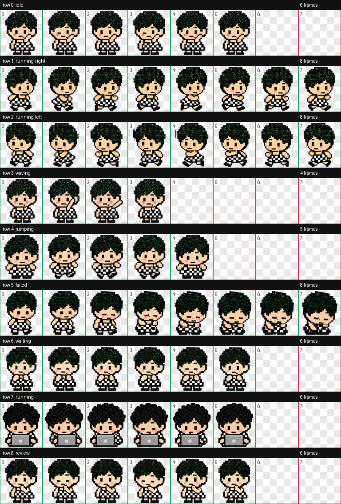

# Pearl Guy / 珍珠小子 Codex Pet

Pearl Guy, or 珍珠小子, is a custom Codex pet inspired by Songyaxuan and handcraft 
deco on Xiaohongshu. His signature feature is a small mole beside his mouth.

珍珠小子是一个自定义 Codex pet，灵感来自宋亚轩和小红书上的拼豆。他的标志性特征是嘴旁边有一颗小痣。



## 认真干活 / Working at the computer


桌面版右键选择 **「认真干活 💻」**，珍珠小子会在电脑前持续循环打字。再次右键点击桌宠即可停止并打开菜单；鼠标移动、左键点击或拖动不会打断工作。

此交互属于[独立桌面 App](desktop-app/README.md)，Codex 内的 pet 状态由 Codex 控制。上方动作概念图已同步更新，第 7 行 `running` 为新的 6 帧电脑打字动作。

## 桌面待机 / Desktop standby

独立桌面 App 待机时保持原位置：常驻 `row 0 idle`，每隔 20–50 秒随机播放 `row 3 waving`、`row 5 failed`、`row 6 waiting` 或 `row 8 review`，结束后回到 idle。待机不自动散步、跳跃或打电脑；手动拖动、悬停互动和右键菜单操作保留。此规则仅适用于独立桌面 App。

## Install / 安装

Copy the `bead-girl` folder into your Codex pets directory:

把 `bead-girl` 文件夹复制到你的 Codex pets 目录：

```bash
cp -R bead-girl ~/.codex/pets/
```

Then choose `Pearl Guy / 珍珠小子` from Codex Settings > Personalization > Pets, or refresh Codex if the pet list is already open.

然后在 Codex Settings > Personalization > Pets 里选择 `Pearl Guy / 珍珠小子`。如果 pet 列表已经打开，可以先刷新一下。

## Files / 文件

- `bead-girl/pet.json` - Codex pet manifest / Codex pet 配置文件
- `bead-girl/spritesheet.webp` - final animated pet spritesheet / 最终动画雪碧图
- `preview/contact-sheet.png` - all states and frames / 全部状态和帧预览
- `preview/gifs/` - per-state animation previews / 每个状态的 GIF 预览

## States / 状态

Includes all 9 Codex pet states: idle, running-right, running-left, waving, jumping, failed, waiting, running, and review.

包含 9 个 Codex pet 状态：idle、running-right、running-left、waving、jumping、failed、waiting、running 和 review。
