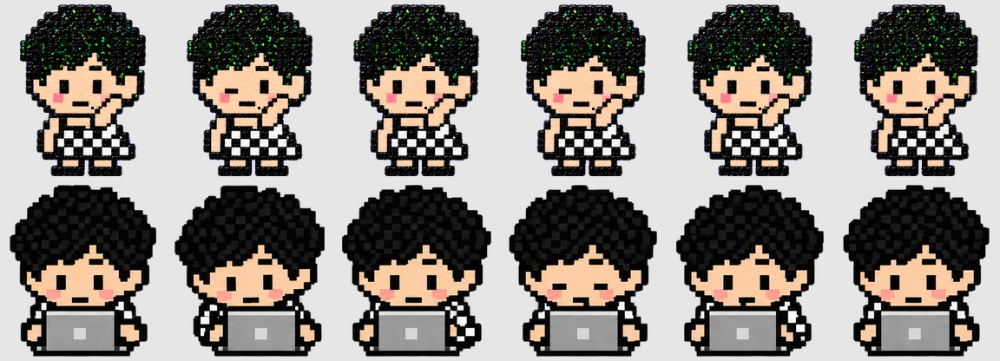

# 认真干活（电脑打字）

## 动作概念图

## 使用方式

右键选择「认真干活 💻」后持续循环；再次右键点击桌宠停止并打开菜单。鼠标进出、左键点击和拖动不会中断工作。工作期间暂停随机动作，停止后恢复。

## 素材与验证

- `bead-girl/spritesheet.webp` 第 7 行（从 0 开始），6 帧，每帧 192×208；其他动画行保持不变。
- 每轮时长 120×5 + 220 = 820ms，手动工作无限循环；桌面待机不再随机触发电脑打字，仅由右键「认真干活」启动。
- 素材提取检查无裁切或透明背景警告。
- 回归测试通过：600 帧、鼠标进出、左键点击/拖动、右键停止、再次启动和悬停恢复。
- 2026-09-22 实际桌面菜单验证通过：开始后持续显示打字，右键后结束。

在 `desktop-app` 目录运行 `./tests/run-work-tests.sh`。如使用 Command Line Tools，可加 `DEVELOPER_DIR=/Library/Developer/CommandLineTools`。
